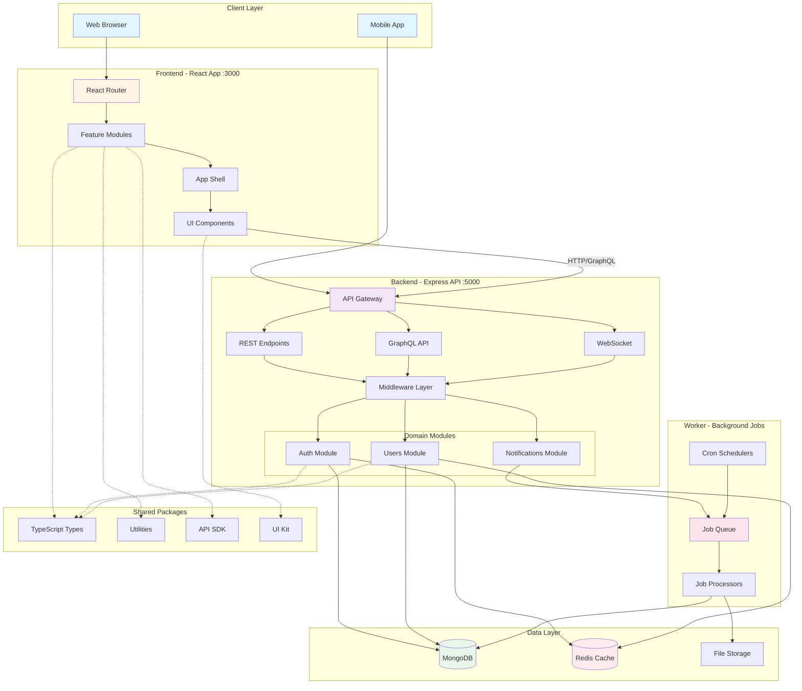

# Better Atimonan

A full-stack web application for Better Atimonan. Built with React, TypeScript, Express, and Tailwind CSS using a Turbo monorepo architecture.

## Features

- **Monorepo Architecture**: Turbo-powered with shared packages
- **Frontend**: React + Vite + Tailwind CSS
- **Backend**: Express.js + MongoDB + Redis
- **Worker**: Background job processor
- **Responsive Design**: Mobile-first approach with modern UI/UX
- **Fast Performance**: Built with Vite for optimal loading speeds

## Architecture Flow



## Quick Start

### Prerequisites

- Node.js 18+
- pnpm 8+
- Git
- Docker & Docker Compose (optional, for databases)

### Installation

#### Step 1: Clone

```bash
git clone <repository-url>
cd better-atimonan
```

#### Step 2: Install pnpm

```bash
npm install -g pnpm@8.15.0
pnpm --version
```

#### Step 3: Install Dependencies

```bash
pnpm install
```

#### Step 4: Environment Configuration

```bash
copy .env.example .env
# Edit .env with your configuration
```

#### Step 5: Start Infrastructure Services (Optional)

```bash
# Start MongoDB, Redis with Docker
pnpm run docker:up
```

#### Step 6: Start Development Servers

```bash
# All services at once
pnpm run dev

# Or individually
pnpm run dev:frontend   # Terminal 1 - Frontend on port 3000
pnpm run dev:backend    # Terminal 2 - Backend on port 5000
pnpm run dev:worker     # Terminal 3 - Worker process
```

#### Step 7: Access the Application

- **Frontend**: http://localhost:3000
- **Backend API**: http://localhost:5000
- **API Documentation**: http://localhost:5000/api-docs

## Development

### Available Scripts

- `pnpm run dev` - Start all development servers (frontend, backend, worker)
- `pnpm run dev:frontend` - Start only frontend dev server (port 3000)
- `pnpm run dev:backend` - Start only backend dev server (port 5000)
- `pnpm run dev:worker` - Start only worker process
- `pnpm run build` - Build all applications for production
- `pnpm run test` - Run all tests
- `pnpm run lint` - Run ESLint on all packages
- `pnpm run format` - Format code with Prettier
- `pnpm run clean` - Clean build artifacts and node_modules
- `pnpm run docker:up` - Start Docker services
- `pnpm run docker:down` - Stop Docker services
- `pnpm run docker:build` - Build Docker images

### Project Structure

```
better-atimonan/
├── apps/                      # Application packages
│   ├── frontend/              # React + Vite frontend
│   │   ├── src/
│   │   │   ├── app/
│   │   │   │   ├── shell/     # App shell and layout
│   │   │   │   ├── providers/ # React providers
│   │   │   │   └── router/    # Routing configuration
│   │   │   ├── modules/       # Feature modules
│   │   │   ├── shared/        # Shared UI components and utilities
│   │   │   └── main.tsx
│   │   ├── public/            # Static assets
│   │   └── tests/             # Test files
│   ├── backend/               # Express.js backend
│   │   ├── src/
│   │   │   ├── bootstrap/     # App initialization
│   │   │   ├── gateway/       # API controllers and routes (HTTP, GraphQL, WebSocket)
│   │   │   ├── modules/       # Domain modules
│   │   │   ├── shared/        # Shared utilities and middleware
│   │   │   ├── infrastructure/# Database and external services
│   │   │   └── main.ts
│   │   └── tests/             # Unit, integration, and E2E tests
│   └── worker/                # Background job processor
│       ├── src/
│       │   ├── jobs/          # Job definitions
│       │   ├── queues/        # Queue configuration
│       │   ├── schedulers/    # Scheduled jobs
│       │   └── processors/    # Job processors
│       └── package.json
├── packages/                  # Shared packages
│   ├── types/                 # Shared TypeScript types
│   ├── utils/                 # Shared utility functions
│   ├── eslint-config/         # ESLint configuration
│   ├── tsconfig/              # TSConfig presets
│   ├── ui-kit/                # Shared UI component library
│   └── sdk/                   # API client SDK
├── infrastructure/            # Infrastructure files
│   ├── docker/                # Docker configuration
│   ├── kubernetes/            # Kubernetes manifests
│   ├── terraform/             # Terraform IaC
│   ├── ansible/               # Ansible playbooks
│   ├── monitoring/            # Prometheus, Grafana, Loki
│   └── scripts/               # Utility scripts
├── docs/                      # Documentation
│   ├── architecture/
│   ├── api/
│   ├── decisions/
│   ├── runbooks/
│   └── diagrams/
├── tools/                     # Development tools
│   ├── generators/            # Code generators
│   ├── codemods/              # Codemod scripts
│   └── automation/            # Automation scripts
└── .github/                   # GitHub workflows and config
    └── workflows/             # CI/CD, lint, security workflows
```

## Documentation

- `docs/architecture/` - Architecture documentation
- `docs/api/` - API documentation
- `docs/decisions/` - Architecture decision records
- `docs/runbooks/` - Operations runbooks
- `docs/diagrams/` - System diagrams

## License

This project is licensed under the MIT License - see the LICENSE file for details.
