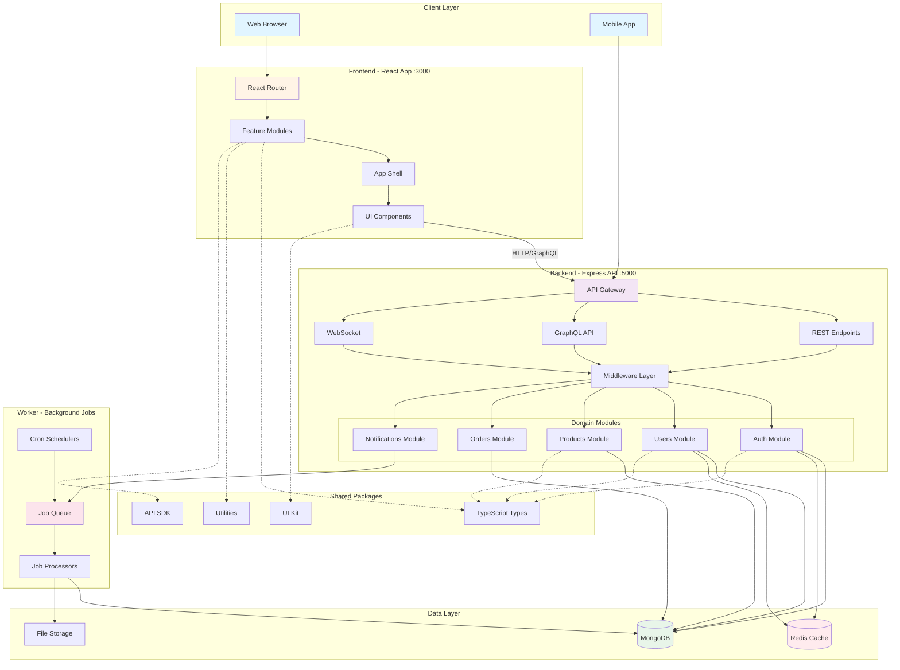
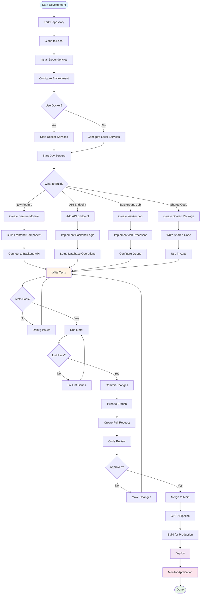

# Monolith Modular Project Template

Enterprise-grade monorepo template for building modern web applications. Built with React, TypeScript, Express, and Tailwind CSS using Turbo monorepo architecture.

**Created by:** [enzox0](https://github.com/enzox0)

## Features

- **Enterprise Monolith Architecture**: Turbo-powered monorepo with shared packages
- **Frontend**: React + Vite + Tailwind CSS
- **Backend**: Express.js + MongoDB + Redis
- **Worker**: Background job processor
- **Responsive Design**: Mobile-first approach with modern UI/UX
- **Customizable**: Easy theming and branding customization
- **Fast Performance**: Built with Vite for optimal loading speeds

## Architecture Flow



## Quick Start

### Prerequisites

- Node.js 18+
- pnpm 8+
- Git
- Docker & Docker Compose (optional, for databases)

### Installation

#### Step 1: Fork and Clone

```bash
# Fork the repository on GitHub, then clone your fork
git clone https://github.com/YOUR_USERNAME/monolith-modular-project-template.git
cd monolith-modular-project-template
```

#### Step 2: Install pnpm

```bash
# Install pnpm globally
npm install -g pnpm@8.15.0

# Verify installation
pnpm --version
```

#### Step 3: Install Dependencies

```bash
# Install all dependencies for all packages
pnpm install
```

#### Step 4: Environment Configuration

```bash
# Copy environment example file
copy .env.example .env

# Edit .env file with your configuration
# - Database URLs
# - API keys
# - Port numbers
# - JWT secrets
```

#### Step 5: Start Infrastructure Services (Optional)

```bash
# Start MongoDB, Redis, and other services with Docker
pnpm run docker:up

# This will start:
# - MongoDB on port 27017
# - Redis on port 6379
# - Other configured services
```

#### Step 6: Start Development Servers

```bash
# Option A: Start all services at once
pnpm run dev

# Option B: Start services individually in separate terminals
pnpm run dev:frontend   # Terminal 1 - Frontend on port 3000
pnpm run dev:backend    # Terminal 2 - Backend on port 5000
pnpm run dev:worker     # Terminal 3 - Worker process
```

#### Step 7: Access the Application

Open your browser and navigate to:
- **Frontend**: http://localhost:3000
- **Backend API**: http://localhost:5000
- **API Documentation**: http://localhost:5000/api-docs

## Step-by-Step Usage Guide

### 1. Creating Your First Feature Module

#### Frontend Module

```bash
# Navigate to frontend modules
cd apps/frontend/src/modules

# Create a new feature module (e.g., 'dashboard')
mkdir dashboard
cd dashboard

# Create module structure
mkdir components hooks services types
touch index.ts
```

**Example Module Structure:**
```typescript
// apps/frontend/src/modules/dashboard/index.ts
export { Dashboard } from './components/Dashboard';
export { useDashboardData } from './hooks/useDashboardData';
```

#### Backend Module

```bash
# Navigate to backend modules
cd apps/backend/src/modules

# Create a new domain module (e.g., 'dashboard')
mkdir dashboard
cd dashboard

# Create module structure
mkdir controllers services repositories dto entities
touch dashboard.module.ts
```

**Example Module Structure:**
```typescript
// apps/backend/src/modules/dashboard/dashboard.module.ts
export class DashboardModule {
  // Module configuration
}
```

### 2. Adding API Endpoints

#### Step 2.1: Define Routes

```typescript
// apps/backend/src/gateway/rest/dashboard.routes.ts
import { Router } from 'express';
import { DashboardController } from '../../modules/dashboard/controllers';

const router = Router();
const controller = new DashboardController();

router.get('/dashboard/stats', controller.getStats);
router.get('/dashboard/analytics', controller.getAnalytics);

export default router;
```

#### Step 2.2: Register Routes

```typescript
// apps/backend/src/bootstrap/routes.ts
import dashboardRoutes from '../gateway/rest/dashboard.routes';

app.use('/api', dashboardRoutes);
```

### 3. Connecting Frontend to Backend

#### Step 3.1: Create API Service

```typescript
// apps/frontend/src/modules/dashboard/services/dashboardApi.ts
import { apiClient } from '@/shared/api/client';

export const dashboardApi = {
  getStats: () => apiClient.get('/dashboard/stats'),
  getAnalytics: () => apiClient.get('/dashboard/analytics'),
};
```

#### Step 3.2: Create Custom Hook

```typescript
// apps/frontend/src/modules/dashboard/hooks/useDashboardData.ts
import { useQuery } from '@tanstack/react-query';
import { dashboardApi } from '../services/dashboardApi';

export const useDashboardData = () => {
  return useQuery({
    queryKey: ['dashboard', 'stats'],
    queryFn: dashboardApi.getStats,
  });
};
```

#### Step 3.3: Use in Component

```typescript
// apps/frontend/src/modules/dashboard/components/Dashboard.tsx
import { useDashboardData } from '../hooks/useDashboardData';

export const Dashboard = () => {
  const { data, isLoading } = useDashboardData();
  
  if (isLoading) return <div>Loading...</div>;
  
  return <div>{/* Render dashboard */}</div>;
};
```

### 4. Adding Background Jobs

#### Step 4.1: Create Job Definition

```typescript
// apps/worker/src/jobs/email-notification.job.ts
export class EmailNotificationJob {
  async process(data: { to: string; subject: string; body: string }) {
    // Send email logic
    console.log(`Sending email to ${data.to}`);
  }
}
```

#### Step 4.2: Register Job Processor

```typescript
// apps/worker/src/processors/index.ts
import { EmailNotificationJob } from '../jobs/email-notification.job';

export const processors = {
  'email:notification': new EmailNotificationJob(),
};
```

#### Step 4.3: Queue Job from Backend

```typescript
// apps/backend/src/modules/notifications/services/notification.service.ts
import { queue } from '../../../infrastructure/messaging';

export class NotificationService {
  async sendEmail(to: string, subject: string, body: string) {
    await queue.add('email:notification', { to, subject, body });
  }
}
```

### 5. Creating Shared Packages

#### Step 5.1: Create Package

```bash
# Navigate to packages directory
cd packages

# Create new package
mkdir my-package
cd my-package

# Initialize package
pnpm init
```

#### Step 5.2: Configure Package

```json
// packages/my-package/package.json
{
  "name": "@repo/my-package",
  "version": "1.0.0",
  "main": "./dist/index.js",
  "types": "./dist/index.d.ts",
  "scripts": {
    "build": "tsc",
    "dev": "tsc --watch"
  }
}
```

#### Step 5.3: Use in Apps

```json
// apps/frontend/package.json or apps/backend/package.json
{
  "dependencies": {
    "@repo/my-package": "workspace:*"
  }
}
```

### 6. Database Operations

#### Step 6.1: Define Entity

```typescript
// apps/backend/src/modules/users/entities/user.entity.ts
export class User {
  id: string;
  email: string;
  name: string;
  createdAt: Date;
}
```

#### Step 6.2: Create Repository

```typescript
// apps/backend/src/modules/users/repositories/user.repository.ts
import { db } from '../../../infrastructure/database';

export class UserRepository {
  async findById(id: string) {
    return db.collection('users').findOne({ id });
  }
  
  async create(user: User) {
    return db.collection('users').insertOne(user);
  }
}
```

### 7. Testing

#### Step 7.1: Unit Tests

```typescript
// apps/backend/src/modules/users/services/__tests__/user.service.test.ts
import { UserService } from '../user.service';

describe('UserService', () => {
  it('should create a user', async () => {
    const service = new UserService();
    const user = await service.create({ email: 'test@example.com' });
    expect(user).toBeDefined();
  });
});
```

#### Step 7.2: Run Tests

```bash
# Run all tests
pnpm run test

# Run tests for specific app
pnpm run test --filter=backend

# Run tests in watch mode
pnpm run test:watch
```

### 8. Building for Production

#### Step 8.1: Build All Apps

```bash
# Build all applications
pnpm run build

# Build specific app
pnpm run build --filter=frontend
pnpm run build --filter=backend
```

#### Step 8.2: Docker Deployment

```bash
# Build Docker images
pnpm run docker:build

# Start production containers
docker-compose -f docker-compose.prod.yml up -d
```

### 9. Customization

#### Step 9.1: Theming (Frontend)

```typescript
// apps/frontend/src/shared/theme/theme.ts
export const theme = {
  colors: {
    primary: '#3B82F6',
    secondary: '#10B981',
    // Add your brand colors
  },
  fonts: {
    heading: 'Inter, sans-serif',
    body: 'Inter, sans-serif',
  },
};
```

#### Step 9.2: Environment Variables

```bash
# .env
NODE_ENV=development
FRONTEND_PORT=3000
BACKEND_PORT=5000

# Database
MONGODB_URI=mongodb://localhost:27017/myapp
REDIS_URL=redis://localhost:6379

# Authentication
JWT_SECRET=your-secret-key
JWT_EXPIRES_IN=7d

# External Services
SMTP_HOST=smtp.gmail.com
SMTP_PORT=587
SMTP_USER=your-email@gmail.com
SMTP_PASS=your-password
```

### 10. Monitoring and Debugging

#### Step 10.1: View Logs

```bash
# Frontend logs
pnpm run dev:frontend

# Backend logs
pnpm run dev:backend

# Worker logs
pnpm run dev:worker

# Docker logs
docker-compose logs -f
```

#### Step 10.2: Debug Mode

```json
// .vscode/launch.json
{
  "configurations": [
    {
      "type": "node",
      "request": "launch",
      "name": "Debug Backend",
      "program": "${workspaceFolder}/apps/backend/src/main.ts",
      "preLaunchTask": "tsc: build - apps/backend/tsconfig.json"
    }
  ]
}
```

## Documentation

- docs/architecture/ - Architecture documentation
- docs/api/ - API documentation
- docs/decisions/ - Architecture decision records
- docs/runbooks/ - Operations runbooks
- docs/diagrams/ - System diagrams

## Development Workflow



## Development

### Available Scripts

- `pnpm run dev` - Start all development servers (frontend, backend, worker)
- `pnpm run dev:frontend` - Start only frontend dev server (port 3000)
- `pnpm run dev:backend` - Start only backend dev server (port 5000)
- `pnpm run dev:worker` - Start only worker process
- `pnpm run build` - Build all applications for production
- `pnpm run test` - Run all tests
- `pnpm run lint` - Run ESLint on all packages
- `pnpm run format` - Format code with Prettier
- `pnpm run clean` - Clean build artifacts and node_modules
- `pnpm run docker:up` - Start Docker services
- `pnpm run docker:down` - Stop Docker services
- `pnpm run docker:build` - Build Docker images

### Project Structure

```
monolith-modular-project-template/
├── apps/                      # Application packages
│   ├── frontend/              # React + Vite frontend
│   │   ├── src/
│   │   │   ├── app/
│   │   │   │   ├── shell/     # App shell and layout
│   │   │   │   ├── providers/ # React providers
│   │   │   │   └── router/    # Routing configuration
│   │   │   ├── modules/       # Feature modules
│   │   │   ├── shared/        # Shared UI components and utilities
│   │   │   └── main.tsx
│   │   ├── public/            # Static assets
│   │   └── tests/             # Test files
│   ├── backend/               # Express.js backend
│   │   ├── src/
│   │   │   ├── bootstrap/     # App initialization
│   │   │   ├── gateway/       # API controllers and routes (HTTP, GraphQL, WebSocket)
│   │   │   ├── modules/       # Domain modules
│   │   │   ├── shared/        # Shared utilities and middleware
│   │   │   ├── infrastructure/# Database and external services
│   │   │   └── main.ts
│   │   └── tests/             # Unit, integration, and E2E tests
│   └── worker/                # Background job processor
│       ├── src/
│       │   ├── jobs/          # Job definitions
│       │   ├── queues/        # Queue configuration
│       │   ├── schedulers/    # Scheduled jobs
│       │   └── processors/    # Job processors
│       └── package.json
├── packages/                  # Shared packages
│   ├── types/                 # Shared TypeScript types
│   ├── utils/                 # Shared utility functions
│   ├── eslint-config/         # ESLint configuration
│   ├── tsconfig/              # TSConfig presets
│   ├── ui-kit/                # Shared UI component library
│   └── sdk/                   # API client SDK
├── infrastructure/            # Infrastructure files
│   ├── docker/                # Docker configuration (frontend, backend, worker, nginx)
│   ├── kubernetes/            # Kubernetes manifests
│   ├── terraform/             # Terraform IaC
│   ├── ansible/               # Ansible playbooks
│   ├── monitoring/            # Prometheus, Grafana, Loki
│   └── scripts/               # Utility scripts
├── docs/                      # Documentation
│   ├── architecture/
│   ├── api/
│   ├── decisions/
│   ├── runbooks/
│   └── diagrams/
├── tools/                     # Development tools
│   ├── generators/            # Code generators
│   ├── codemods/              # Codemod scripts
│   └── automation/            # Automation scripts
└── .github/                   # GitHub workflows and config
    └── workflows/             # CI/CD, lint, security workflows
```

## License

This project is licensed under the MIT License - see the LICENSE file for details.

---

**Created by [enzox0](https://github.com/enzox0)**
