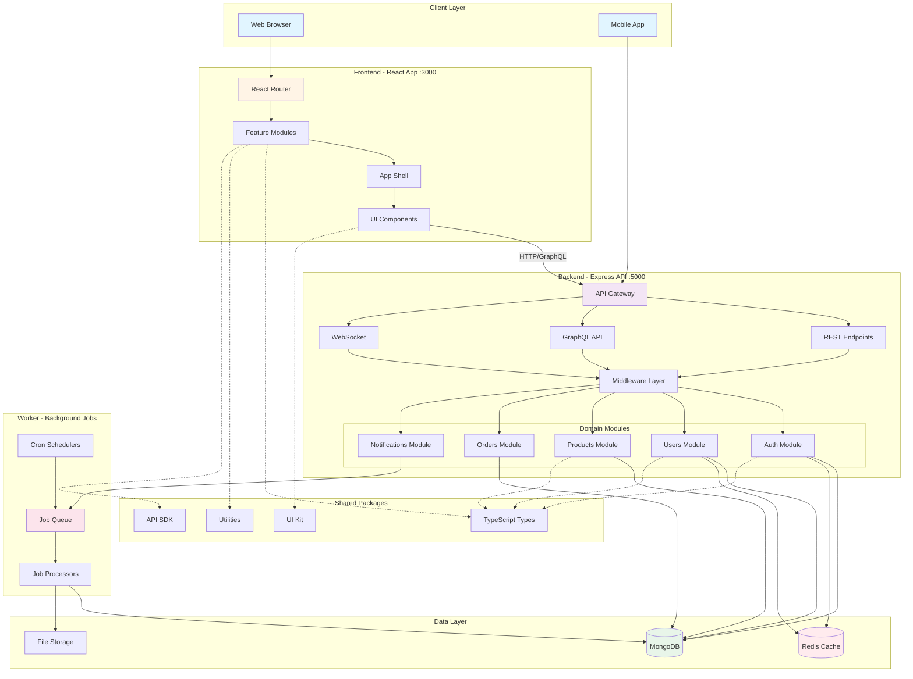

# Better Atimonan

A modern web application for Atimonan. Built with React, TypeScript, Express, and Tailwind CSS using Turbo monorepo architecture.

## Features

- **Monolith Modular Architecture**: Turbo-powered monorepo with shared packages
- **Frontend**: React + Vite + Tailwind CSS
- **Backend**: Express.js + MongoDB + Redis
- **Worker**: Background job processor
- **Responsive Design**: Mobile-first approach with modern UI/UX
- **Fast Performance**: Built with Vite for optimal loading speeds

## Architecture Flow



## Quick Start

### Prerequisites

- Node.js 18+
- pnpm 8+
- Git
- Docker & Docker Compose (optional, for databases)

### Installation

```bash
# Clone the repository
git clone https://github.com/YOUR_USERNAME/betteratimonan.git
cd betteratimonan

# Install pnpm globally
npm install -g pnpm@8.15.0

# Install all dependencies
pnpm install

# Copy environment example file
copy .env.example .env

# Start Docker services (optional)
pnpm run docker:up

# Start all development servers
pnpm run dev
```

### Access the Application

- **Frontend**: http://localhost:3000
- **Backend API**: http://localhost:5000
- **API Documentation**: http://localhost:5000/api-docs

## Available Scripts

- `pnpm run dev` - Start all development servers (frontend, backend, worker)
- `pnpm run dev:frontend` - Start only frontend dev server (port 3000)
- `pnpm run dev:backend` - Start only backend dev server (port 5000)
- `pnpm run dev:worker` - Start only worker process
- `pnpm run build` - Build all applications for production
- `pnpm run test` - Run all tests
- `pnpm run lint` - Run ESLint on all packages
- `pnpm run format` - Format code with Prettier
- `pnpm run clean` - Clean build artifacts and node_modules
- `pnpm run docker:up` - Start Docker services
- `pnpm run docker:down` - Stop Docker services
- `pnpm run docker:build` - Build Docker images

## Project Structure

```
betteratimonan/
├── apps/
│   ├── frontend/              # React + Vite frontend
│   ├── backend/               # Express.js backend
│   └── worker/                # Background job processor
├── packages/                  # Shared packages
│   ├── types/                 # Shared TypeScript types
│   ├── utils/                 # Shared utility functions
│   ├── eslint-config/         # ESLint configuration
│   ├── tsconfig/              # TSConfig presets
│   ├── ui-kit/                # Shared UI component library
│   └── sdk/                   # API client SDK
├── infrastructure/            # Docker, Kubernetes, Terraform, monitoring
├── docs/                      # Documentation
├── tools/                     # Development tools and generators
└── .github/                   # CI/CD workflows
```

## License

This project is licensed under the MIT License - see the LICENSE file for details.
